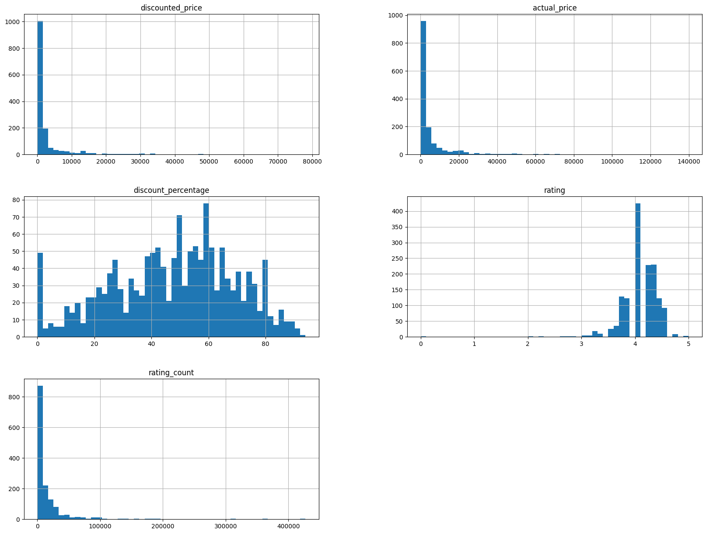
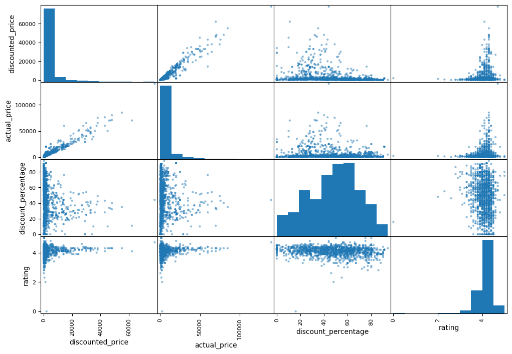
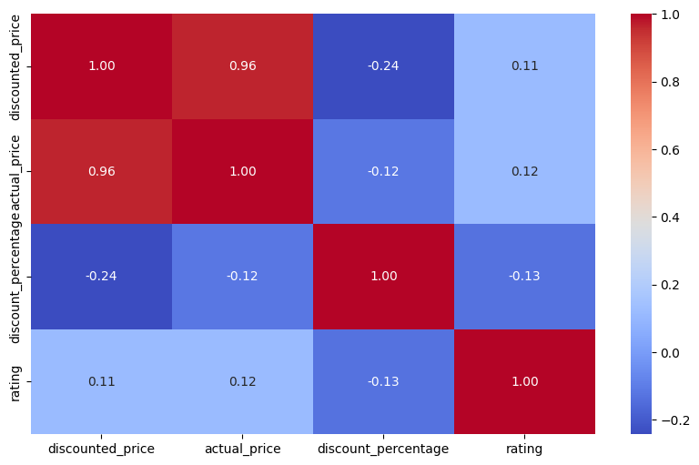
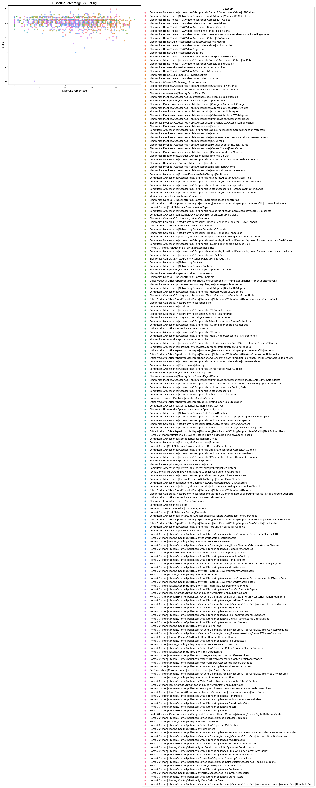
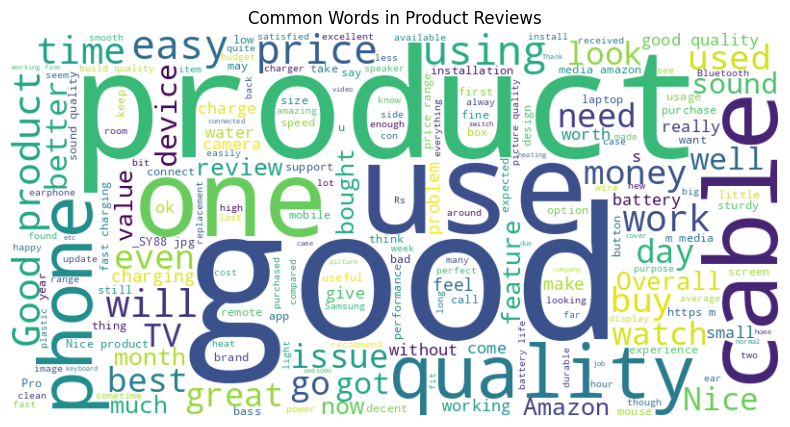
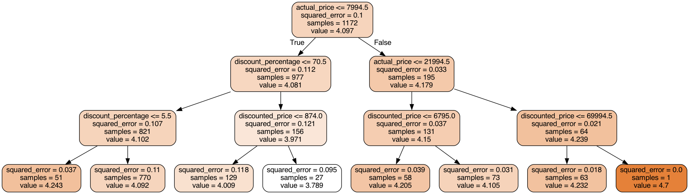

# 导入文件


```python
import pandas as pd
import matplotlib.pyplot as plt
import numpy as np
import seaborn as sns
```


```python
data = pd.read_csv('amazon.csv')
```

# 一、数据预处理：替换缺失值为0


```python
for col in ['discounted_price',	'actual_price',	'discount_percentage','rating',	'rating_count']:
  data[col]=data[col].astype(str).str.replace('₹','').str.replace('%','').str.replace(',','').str.replace('nan','0')
  data[col] = pd.to_numeric(data[col].str.replace('[^0-9.]','',regex=True),errors='coerce').fillna(0)
```


```python
data.head()
```

```python
data.info()
```

    <class 'pandas.core.frame.DataFrame'>
    RangeIndex: 1465 entries, 0 to 1464
    Data columns (total 16 columns):
     #   Column               Non-Null Count  Dtype  
    ---  ------               --------------  -----  
     0   product_id           1465 non-null   object 
     1   product_name         1465 non-null   object 
     2   category             1465 non-null   object 
     3   discounted_price     1465 non-null   float64
     4   actual_price         1465 non-null   float64
     5   discount_percentage  1465 non-null   int64  
     6   rating               1465 non-null   float64
     7   rating_count         1465 non-null   int64  
     8   about_product        1465 non-null   object 
     9   user_id              1465 non-null   object 
     10  user_name            1465 non-null   object 
     11  review_id            1465 non-null   object 
     12  review_title         1465 non-null   object 
     13  review_content       1465 non-null   object 
     14  img_link             1465 non-null   object 
     15  product_link         1465 non-null   object 
    dtypes: float64(3), int64(2), object(11)
    memory usage: 183.2+ KB


```python
data.columns
```


    Index(['product_id', 'product_name', 'category', 'discounted_price',
           'actual_price', 'discount_percentage', 'rating', 'rating_count',
           'about_product', 'user_id', 'user_name', 'review_id', 'review_title',
           'review_content', 'img_link', 'product_link'],
          dtype='object')


```python
data.isnull().sum()
```


    product_id             0
    product_name           0
    category               0
    discounted_price       0
    actual_price           0
    discount_percentage    0
    rating                 0
    rating_count           0
    about_product          0
    user_id                0
    user_name              0
    review_id              0
    review_title           0
    review_content         0
    img_link               0
    product_link           0
    dtype: int64


# 二、EDA 描述性统计

# EDA：对数值列进行描述性统计分析，罗列出最大值，最小值，标准差; 25%, 50%, 75%置信区间


```python
data[['discounted_price','actual_price','discount_percentage']].describe()
```


# 显示不同级别的评分共出现了多少次


```python
data['rating'].value_counts()
```


    4.1    244
    4.3    230
    4.2    228
    4.0    181
    3.9    123
    4.4    123
    3.8     86
    4.5     75
    3.7     42
    3.6     35
    3.5     26
    4.6     17
    3.3     16
    3.4     10
    4.7      6
    3.0      4
    3.1      4
    5.0      3
    4.8      3
    3.2      2
    2.8      2
    2.3      1
    0.0      1
    2.0      1
    2.6      1
    2.9      1
    Name: rating, dtype: int64


# 按照类别分组，并且给予平均值降序排列


```python
data.groupby('category')['rating'].mean().sort_values(ascending=False)
```


    category
    Computers&Accessories|Tablets                                                                                    4.60
    Computers&Accessories|NetworkingDevices|NetworkAdapters|PowerLANAdapters                                         4.50
    Electronics|Cameras&Photography|Accessories|Film                                                                 4.50
    Electronics|HomeAudio|MediaStreamingDevices|StreamingClients                                                     4.50
    OfficeProducts|OfficeElectronics|Calculators|Basic                                                               4.50
                                                                                                                     ... 
    Electronics|HomeTheater,TV&Video|Accessories|3DGlasses                                                           3.50
    Computers&Accessories|Accessories&Peripherals|Audio&VideoAccessories|PCHeadsets                                  3.50
    Home&Kitchen|Kitchen&HomeAppliances|Vacuum,Cleaning&Ironing|Vacuums&FloorCare|Vacuums|HandheldVacuums            3.45
    Computers&Accessories|Accessories&Peripherals|Keyboards,Mice&InputDevices|Keyboard&MiceAccessories|DustCovers    3.40
    Home&Kitchen|Kitchen&HomeAppliances|Coffee,Tea&Espresso|CoffeeGrinders|ElectricGrinders                          3.30
    Name: rating, Length: 211, dtype: float64


# EDA: 对数值列进行初步可视化


```python
data.hist(bins=50, figsize=(20, 15))
```


    array([[<AxesSubplot:title={'center':'discounted_price'}>,
            <AxesSubplot:title={'center':'actual_price'}>],
           [<AxesSubplot:title={'center':'discount_percentage'}>,
            <AxesSubplot:title={'center':'rating'}>],
           [<AxesSubplot:title={'center':'rating_count'}>, <AxesSubplot:>]],
          dtype=object)


    

    


# EDA: 对4列数据进行相关性分析


```python
from pandas.plotting import scatter_matrix
attributes = ['discounted_price', 'actual_price', 'discount_percentage', 'rating']
scatter_matrix(data[attributes], figsize=(12, 8))
```


    array([[<AxesSubplot:xlabel='discounted_price', ylabel='discounted_price'>,
            <AxesSubplot:xlabel='actual_price', ylabel='discounted_price'>,
            <AxesSubplot:xlabel='discount_percentage', ylabel='discounted_price'>,
            <AxesSubplot:xlabel='rating', ylabel='discounted_price'>],
           [<AxesSubplot:xlabel='discounted_price', ylabel='actual_price'>,
            <AxesSubplot:xlabel='actual_price', ylabel='actual_price'>,
            <AxesSubplot:xlabel='discount_percentage', ylabel='actual_price'>,
            <AxesSubplot:xlabel='rating', ylabel='actual_price'>],
           [<AxesSubplot:xlabel='discounted_price', ylabel='discount_percentage'>,
            <AxesSubplot:xlabel='actual_price', ylabel='discount_percentage'>,
            <AxesSubplot:xlabel='discount_percentage', ylabel='discount_percentage'>,
            <AxesSubplot:xlabel='rating', ylabel='discount_percentage'>],
           [<AxesSubplot:xlabel='discounted_price', ylabel='rating'>,
            <AxesSubplot:xlabel='actual_price', ylabel='rating'>,
            <AxesSubplot:xlabel='discount_percentage', ylabel='rating'>,
            <AxesSubplot:xlabel='rating', ylabel='rating'>]], dtype=object)


    

    


#  我们着重关注最后一行的用户最终评分，可以看到评分与 打折后的价格、原价格、打折力度有着明显的线性相关趋势。尤其关注打折力度和最终评分的关系，之后可以考虑用线性回归模型进行建模分析，下面我们查看他们之间的皮尔逊相关系数


```python
corr_matrix = data[['discounted_price','actual_price','discount_percentage', 'rating']].corr()
```


```python
corr_matrix
```


```python
plt.figure(figsize=(10,6))
sns.heatmap(corr_matrix, annot=True, cmap='coolwarm', fmt='.2f')
plt.show()
```


    

    


# 可以看到两者之间的皮尔逊系数为-0.13，打折力度增加用户评分反而可能下降，这一现象可能符合买家的某些心理，例如：最贵的一定是最好的

# EDA: 深入探索，这次区分商品类别


```python
plt.figure(figsize=(10, 6))
sns.scatterplot(data=data, x="discount_percentage", y="rating", hue="category", alpha=0.7)
plt.title("Discount Percentage vs. Rating")
plt.xlabel("Discount Percentage")
plt.ylabel("Rating")
plt.legend(title="Category", bbox_to_anchor=(1, 1))
plt.show()
```


    

    


# EDA:使用wordcloud统计用户评论中的高频词汇


```python
from wordcloud import WordCloud

text = " ".join(data['review_content'].dropna())  # Combine all reviews
wordcloud = WordCloud(width=800, height=400, background_color="white").generate(text)

plt.figure(figsize=(10, 5))
plt.imshow(wordcloud, interpolation="bilinear")
plt.axis("off")
plt.title("Common Words in Product Reviews")
plt.show()


```


    

    


# 三、使用决策树模型建模

### 对类别数据进行独热编码


```python
data['categories'] = data['category'].str.split('|')
```


```python
data['categories'].head()
```


    0    [Computers&Accessories, Accessories&Peripheral...
    1    [Computers&Accessories, Accessories&Peripheral...
    2    [Computers&Accessories, Accessories&Peripheral...
    3    [Computers&Accessories, Accessories&Peripheral...
    4    [Computers&Accessories, Accessories&Peripheral...
    Name: categories, dtype: object


```python
from sklearn.preprocessing import OneHotEncoder
data['categories'] = data['categories'].apply(lambda x: ' '.join(x) if isinstance(x, list) else x)
cat_encoder = OneHotEncoder()
data_cat_1hot = cat_encoder.fit_transform(data[['categories']])
```


```python
data_cat_1hot
```


    <1465x211 sparse matrix of type '<class 'numpy.float64'>'
    	with 1465 stored elements in Compressed Sparse Row format>


```python
# Convert the one-hot encoded array to a DataFrame
encoded_df = pd.DataFrame(data_cat_1hot.toarray(), columns=cat_encoder.categories_[0])

# Concatenate the original DataFrame with the one-hot encoded DataFrame
data = pd.concat([data, encoded_df], axis=1)
```


```python
data.head()
```


### 使用PCA降维


```python
from sklearn.decomposition import PCA
from sklearn.model_selection import train_test_split

X = data.drop(columns=['product_id', 'product_name', 'category', 'about_product', 'product_id', 'user_id', 'user_name', 'review_id', 'review_title', 'review_content', 'img_link', 'product_link', 'categories', 'rating', 'rating_count', 0])
Y = data['rating']
X = data[['discounted_price', 'actual_price', 'discount_percentage']]
X_train, X_test, Y_train, Y_test = train_test_split(X, Y, test_size=0.2, random_state=42)
X_train
```


```python
from sklearn.tree import DecisionTreeRegressor
from sklearn.metrics import mean_squared_error
from sklearn.model_selection import GridSearchCV

# Initialize the decision tree regressor
model = DecisionTreeRegressor(random_state=42)

# Define the parameter grid for grid search
param_grid = {
    'max_depth': [3, 5, 10, None],
    'min_samples_split': [2, 5, 10],
    'min_samples_leaf': [1, 2, 4],
}

# Set up GridSearchCV with cross-validation
grid_search = GridSearchCV(estimator=model, param_grid=param_grid, cv=5, n_jobs=-1, scoring='neg_mean_squared_error')

# Fit the grid search to the data
grid_search.fit(X_train, Y_train)

# Get the best parameters from the grid search
best_params = grid_search.best_params_
print(f"Best Parameters: {best_params}")

# Use the best model found by grid search to make predictions
best_model = grid_search.best_estimator_

# Make predictions on the test set
Y_pred = best_model.predict(X_test)

# Evaluate the model's performance
mse = mean_squared_error(Y_test, Y_pred)
print(f"Mean Squared Error: {mse}")

```

    Best Parameters: {'max_depth': 3, 'min_samples_leaf': 1, 'min_samples_split': 5}
    Mean Squared Error: 0.07989262918129585


```python
model
```


```python
from sklearn.tree import export_graphviz
feature_names = ['discounted_price', 'actual_price', 'discount_percentage']
class_names = ['rating']
export_graphviz(
    best_model,
    out_file='tree.dot',
    feature_names=feature_names,
    class_names=class_names,
    rounded=True,
    filled=True
)
```


```python
from IPython.display import Image

# Display the PNG image
Image(filename='tree.png')

```


    

    


# 结论    
样本量与误差的关系:
    样本量较大时（如821个样本），均方误差（squared_error）较高（0.107），表明数据变异性较大或模型预测难度增加。
    样本量较小时（如51、58、59个样本），均方误差显著降低（0.037–0.039），可能因数据更一致或模型在特定子群体中表现更好。
    极端情况：样本量为1时，误差极低（0.01），但缺乏统计意义，可能为过拟合或偶然结果。

折扣率的影响 (仅第一个表格):
    当折扣率（discount_percentage）≤ 5.5%时，样本量较大（821），预测值（value=4.126）低于其他分组（如4.243、4.205），可能暗示低折扣率与较低目标值相关。

预测值的分布趋势:
    预测值（value）在样本量适中的分组（如51、58、59个样本）中较高（4.243–4.232），而在样本量较少（如27个样本）或极多（如821个样本）时较低（3.789–4.126），可能反映数据分布的非线性特征。
    
模型稳定性:
    均方误差波动较大（0.01–0.118），表明模型在不同数据子集上的表现差异显著，需进一步优化或验证分组的合理性。


```python

```
